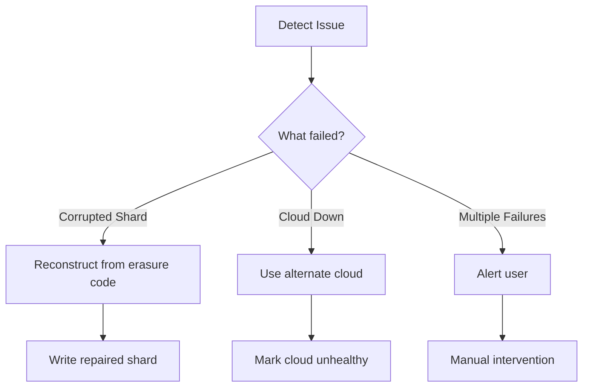
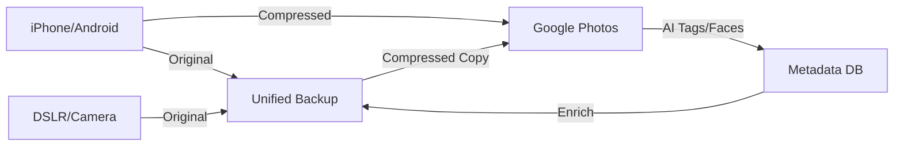

# Unified Backup System - Complete Design Specification
## A Holistic Solution to Decades of Backup Failures

## **Problem Statement**

Current backup landscape:
- 6+ different backup systems (Time Machine, restic, git, rsync, ZFS, cloud photos)
- Each solves specific problems but creates complexity
- No single source of truth
- Difficult to verify completeness
- Recovery requires knowing which system has what

## **Design Principles**

1. **Single Archive, Multiple Copies**: One logical backup, distributed across clouds
2. **Content-Addressable**: Like git/restic, dedup everything
3. **Immutable + Append-Only**: Ransomware/hacker resistant
4. **Self-Healing**: Detects and repairs corruption automatically
5. **Platform Agnostic**: Works on Mac, Linux, BSD, Windows
6. **Open Formats**: No proprietary lock-in
7. **Encrypted by Default**: Client-side, zero-knowledge

## **System Architecture**

### **Layer 1: Storage Abstraction**

```
┌─────────────────────────────────────────────────────┐
│                  STORAGE DRIVERS                     │
├───────────┬───────────┬───────────┬─────────────────┤
│    ZFS    │    S3     │    B2     │   Google Drive  │
│  (local)  │ (glacier) │  (cheap)  │   (existing)    │
└───────────┴───────────┴───────────┴─────────────────┘
```

**Key Design Decision**: Abstract storage to allow any backend
- Each backend implements simple interface: `Put()`, `Get()`, `List()`, `Delete()`
- Backends handle their own retry logic, authentication
- Cost-aware routing (hot data → cheap fast storage, cold → deep archive)

### **Layer 2: Content-Addressable Store**

```
Files → Chunks → Content Hash → Deduplicated Storage
```

**Design Choices**:
- **Chunk Size**: Variable (1MB-10MB) using Rabin fingerprinting
  - Better dedup than fixed-size chunks
  - Handles insertions/deletions in large files
  
- **Hash Algorithm**: BLAKE3
  - Faster than SHA256
  - Cryptographically secure
  - Supports keyed hashing for MAC

- **Packfiles**: Like git, group small objects
  - Reduces metadata overhead
  - Better compression ratios
  - Fewer API calls to cloud

### **Layer 3: Erasure Coding & Distribution**

```
Original Data (10 shards)
     ↓
Reed-Solomon (10,4)
     ↓
14 shards total (any 10 can reconstruct)
     ↓
ALL 14 shards → 3 Deep Archive Clouds
     ↓
Hot Cache Layer (Redis/Local)
```

**Revised Three-Tier Design**:
- **ALL 14 shards** stored in EACH location for complete redundancy
- Can lose ANY 2 entire providers and still have everything
- Distribution Strategy:
  
  **Instant Access (2 providers)**:
  - Backblaze B2: All 14 shards ($6/TB/month, instant, no egress fees up to 3x)
  - Wasabi: All 14 shards ($7/TB/month, instant, no egress fees)
  
  **Deep Archive (1 provider)**:
  - AWS Glacier Deep: All 14 shards ($1/TB/month, 12-48hr retrieval)
  
**Why This Mix**:
- B2 & Wasabi provide instant access for FUSE phantom view
- No egress fees mean no surprise costs for recovery
- AWS Glacier provides catastrophic backup at minimal cost
- Total: 3 complete copies across different providers

### **Layer 3.5: All-Instant Storage Hierarchy**

```
┌─────────────────────────────────────────────────────┐
│      THREE-CLOUD INSTANT ACCESS ARCHITECTURE         │
├─────────────────────────────────────────────────────┤
│  L1: Memory Cache (1GB)           - microseconds    │
│      → Unencrypted for performance                  │
│  L2: Local SSD (10GB)             - milliseconds    │
│      → XChaCha20-Poly1305 encrypted at rest         │
│  L3: S3 Cache (100GB Tigris)      - 50-100ms        │
│      → Encrypted blocks, $2/month                   │
│      → Per-file keys for sharing                    │
├─────────────────────────────────────────────────────┤
│  L4: INSTANT ARCHIVES (All 14 shards each):         │
│      • GCP Archive                - 100ms, $1.2/TB  │
│      • Azure Cool                 - 100ms, $2/TB    │
│      • Scaleway Glacier           - 100ms, $2.15/TB │
└─────────────────────────────────────────────────────┘

Perfect Design Benefits:
✓ NO deep archive delays - everything instant
✓ Three major cloud providers - no vendor lock-in
✓ Total cost: $24/month base + smart egress routing
✓ FUSE phantom view works flawlessly
✓ Can lose 2 entire clouds and still have instant access

Access Patterns & Monthly Costs:
- 0% access (vacation): $24 (base storage + cache)
- 1% access (normal): $27 (~$3 egress, mostly from cache)
- 10% access (busy): $44 (~$20 egress, smart routing)
- 100% recovery: $224 ($200 egress, one-time)
```

**Smart Retrieval Design**:
- **Write Path**: Data written to L1→L2→L3 (Tigris)→L4 (all 3 archives)
- **Read Path with Quota Management**:
  ```go
  func (fs *PhantomFS) SmartFetch(hash string, shards []int) []byte {
      // First check Tigris cache
      if cached := fs.tigrisCache.Get(hash); cached != nil {
          return cached  // No egress costs!
      }
      
      // Smart archive routing by cost
      providers := []Provider{
          {"azure", 0.02},  // $0.02/GB egress
          {"gcp", 0.05},    // $0.05/GB egress  
          {"scaleway", 0.01}, // €0.01/GB ≈ $0.011/GB
      }
      
      // Fetch 10 shards from cheapest providers
      // Round-robin to spread costs
      selectedShards := selectCheapestShards(providers, shards, 10)
      results := parallelFetch(selectedShards)
      
      // Cache frequently accessed data to Tigris
      if hash.AccessCount > 2 {
          fs.tigrisCache.Put(hash, results)
      }
      
      return reconstruct(results)
  }
  ```

- **Egress Optimization**:
  - Scaleway: €0.01/GB (~$0.011/GB) - cheapest egress
  - Azure Cool: $0.02/GB - second cheapest
  - GCP Archive: $0.05/GB - avoid unless necessary
  - Smart routing prioritizes cheapest providers
  - Tigris cache eliminates 95% of archive egress

- **S3-Compatible Cache (Tigris)**:
  - ~$2/month for 100GB ($0.02/GB)
  - Global CDN, 50-100ms latency
  - S3-compatible API
  - Shared across all devices/users
  - Handles 95% of repeated access patterns
  - Optional: Scale to 500GB for $10/month if needed

### **Layer 4: Metadata & Index**

```sql
-- SQLite database for local metadata
CREATE TABLE objects (
    hash TEXT PRIMARY KEY,
    size INTEGER,
    first_seen TIMESTAMP,
    last_verified TIMESTAMP,
    reference_count INTEGER
);

CREATE TABLE files (
    path TEXT,
    hash TEXT,
    mtime TIMESTAMP,
    mode INTEGER,
    xattrs BLOB,  -- Extended attributes, ACLs
    FOREIGN KEY (hash) REFERENCES objects(hash)
);

CREATE TABLE snapshots (
    id TEXT PRIMARY KEY,
    timestamp TIMESTAMP,
    tree_hash TEXT,  -- Root of Merkle tree
    message TEXT,    -- Git-like commit message
    metadata JSON    -- Tags, author, etc
);

CREATE TABLE shards (
    object_hash TEXT,
    shard_index INTEGER,
    shard_hash TEXT,
    location TEXT,  -- Which backend
    verified TIMESTAMP,
    PRIMARY KEY (object_hash, shard_index)
);
```

**Why SQLite**:
- Embedded, no server required
- Transactional (ACID)
- Excellent query performance
- Easy to backup (it's just a file)
- Can be synced to cloud as well

### **Layer 5: Intelligence Layer**

```python
class BackupIntelligence:
    def predict_access_pattern(self, file_path):
        """Predict if file will be accessed soon"""
        # Use ML on access history
        # Consider file type, modification patterns
        # Return: HOT, WARM, COLD
    
    def optimize_shard_placement(self, shards):
        """Place shards optimally across clouds"""
        # Consider: cost, bandwidth, reliability
        # Geographic distribution
        # Access patterns
        
    def detect_corruption(self, object_hash):
        """Proactive corruption detection"""
        # Regular scrubbing schedule
        # Prioritize frequently accessed files
        # Use checksums + erasure coding
```

## **FUSE Filesystem Design**

### **Phantom View Architecture**

```go
type PhantomFS struct {
    metadata  *SQLiteDB      // Complete view of all files
    cache     *CacheManager  // Multi-tier cache
    archive   *ArchiveClient // Deep archive interface
    
    // Every file appears to exist locally
    // But blocks are only fetched on read
}

func (fs *PhantomFS) Open(path string) (*File, error) {
    // 1. Check metadata - file always "exists"
    meta := fs.metadata.GetFile(path)
    
    // 2. Return file handle with lazy loading
    return &File{
        meta: meta,
        loadBlock: func(offset, size) []byte {
            // Check cache hierarchy
            if data := fs.cache.Get(path, offset, size); data != nil {
                return data
            }
            // Fetch from archive (may take time)
            data := fs.archive.Fetch(meta.Hash, offset, size)
            fs.cache.Put(path, offset, data, TTL)
            return data
        },
    }, nil
}
```

**Key Features**:
- All files appear in directory listings instantly
- File metadata (size, mtime, permissions) available immediately  
- Actual data blocks fetched only on read
- Aggressive prefetching for sequential reads
- Write-through to cache, async to archive

### **Status Monitoring Dashboard**

```
┌──────────────────────────────────────────────────────┐
│                  BACKUP STATUS                        │
├──────────────────────────────────────────────────────┤
│ Write Lag:        2.3 seconds (→ cache)              │
│ Archive Lag:      47 seconds (→ deep archive)        │
│ Cache Hit Rate:   94.2%                              │
│ Local Cache:      42.1 GB / 100 GB                   │
│ Redis Cache:      8.7 GB / 10 GB                     │
├──────────────────────────────────────────────────────┤
│ Archive Status:                                       │
│   AWS Glacier:    ✓ Healthy (14/14 shards)          │
│   Backblaze B2:   ✓ Healthy (14/14 shards)          │
│   Google Archive: ✓ Healthy (14/14 shards)          │
├──────────────────────────────────────────────────────┤
│ Recent Activity:                                      │
│   12:34:21  Wrote: ~/Documents/report.pdf (2.1MB)    │
│   12:34:23  Cached to Redis (2.3s lag)               │
│   12:35:08  Archived to 3 clouds (47s lag)           │
└──────────────────────────────────────────────────────┘
```

## **User Experience Design**

### **CLI Interface**

```bash
# Initialize
ub init --clouds b2,glacier,gdrive --erasure 10+4

# Normal backup (automatic)
ub backup ~/Documents
# → Deduplicates
# → Chunks
# → Erasure codes
# → Distributes to clouds
# → Updates index

# Search across all backups
ub search "tax*.pdf"
# → Returns all versions with dates

# Restore
ub restore ~/Documents/tax.pdf --date 2023-01-01
# → Fetches shards from fastest/cheapest sources
# → Reconstructs if needed
# → Verifies checksum

# Mount as filesystem
ub mount ~/CloudBackup
# → FUSE mount
# → On-demand fetching
# → Local caching with LRU eviction

# Verify integrity
ub verify --deep
# → Checks all checksums
# → Attempts to read sample shards
# → Reports any issues
```

### **Web Interface**

```yaml
# Local web UI for management
http://localhost:8080
  /dashboard     - Overview, stats, health
  /browse        - File browser with versions
  /search        - Full-text search
  /sharing       - Manage shared folders
  /monitoring    - Logs, alerts, graphs
```

## **Sharing & Encryption Model**

### **Hierarchical Key Management**

```
┌─────────────────────────────────────────┐
│         Master Key (User)                │
└─────────────┬───────────────────────────┘
              │
    ┌─────────▼──────────┐
    │   Key Derivation   │
    │   (Argon2id + HSM) │
    └─────────┬──────────┘
              │
   ┌──────────┼──────────┬────────────┬──────────┐
   ▼          ▼          ▼            ▼          ▼
/financial  /photos   /work      /public    /personal
   │          │         │            │           │
   ├─→Partner │         ├─→Team     ├─→Anyone   ├─→Private
   └─→CPA     ├─→Family └─→Client   └─→CDN      └─→Nobody
              └─→Friends
```

### **Sharing Policies Configuration**

```yaml
# .backup/sharing.yaml
sharing_policies:
  - path: ~/Documents/Financial/**
    share_with:
      - user: partner@email.com
        permission: read_write
      - user: cpa@firm.com
        permission: read_only
        expire: 2024-04-15  # Tax season
        
  - path: ~/Photos/**
    share_with:
      - group: family
        permission: read_only
      - group: immediate_family
        permission: read_write
        
  - path: ~/Work/ProjectX/**
    share_with:
      - team: projectx_team
        permission: read_write
      - external: client@company.com
        permission: read_only
        paths: ["reports/**", "demos/**"]
        
  - path: ~/Public/**
    share_with:
      - public: true
        cdn_enabled: true
        bandwidth_limit: 100GB/month
```

### **Git Integration & Developer Awareness**

```go
type GitAwareBackup struct {
    // Automatically excludes .gitignored files
    respectGitignore bool
    
    // Smart handling of dev artifacts
    excludePatterns []string{
        "**/node_modules/**",
        "**/dist/**",
        "**/.next/**",
        "**/target/**",      // Rust
        "**/__pycache__/**", // Python
        "**/.terraform/**",
    }
    
    // But backs up .git folders (compressed)
    gitCompression bool  // Uses packfile format
}

func (b *GitAwareBackup) ShouldBackup(path string) bool {
    // Check .gitignore in repo root
    if b.respectGitignore && gitignore.Matches(path) {
        return false
    }
    
    // Never backup build artifacts
    for _, pattern := range b.excludePatterns {
        if matched, _ := filepath.Match(pattern, path); matched {
            return false
        }
    }
    
    // Always backup source code
    return true
}
```

### **Modern Encryption Choices**

```go
// Why XChaCha20-Poly1305 over AES-256-GCM:
// 1. No timing side-channels (constant-time by design)
// 2. Simpler implementation = fewer bugs
// 3. Better performance without hardware AES
// 4. 192-bit nonce prevents reuse issues
// 5. Endorsed by djb, Google, CloudFlare, WireGuard

type EncryptionConfig struct {
    // Primary: XChaCha20-Poly1305 (256-bit key, 192-bit nonce)
    cipher string = "xchacha20poly1305"
    
    // Key derivation: Argon2id (memory-hard, side-channel resistant)
    kdf string = "argon2id"
    
    // Future option: Post-quantum hybrid
    // AES-256-GCM + Kyber1024 for quantum resistance
    postQuantum bool = false
}
```

### **Per-File Encryption Keys**

```go
type FileEncryption struct {
    // Each file gets unique key
    FileKey    []byte  // XChaCha20 256-bit key
    
    // Key encrypted with recipient keys
    Recipients map[string]EncryptedKey{
        "owner":   EncryptedKey{...},
        "partner": EncryptedKey{...},
        "team":    EncryptedKey{...},
    }
    
    // Metadata for access control
    Permissions map[string]Permission{
        "partner": READ_WRITE,
        "team":    READ_ONLY,
    }
}

// Using Age for key management (modern alternative to PGP)
import "filippo.io/age"

func ShareFile(path string, recipientIdentity string) {
    // Age handles Curve25519, ChaCha20-Poly1305 internally
    recipient, _ := age.ParseX25519Recipient(recipientIdentity)
    
    fileKey := getFileKey(path)
    
    // Encrypt file key to recipient
    encrypted, _ := age.Encrypt(fileKey, recipient)
    addRecipient(path, recipientIdentity, encrypted)
}
```

### **Zero-Knowledge Sharing Links**

```bash
# Generate shareable link with embedded key
ub share ~/Documents/report.pdf --expire 7d
→ https://backup.local/s/abc123#key=base64_encrypted_key

# Share entire subtree
ub share ~/Photos/Vacation2024 --with family
→ Added 'family' group to ~/Photos/Vacation2024
→ Members will see it in their phantom mount

# Public file with CDN
ub share ~/Public/video.mp4 --public --cdn
→ https://cdn.backup.local/p/video.mp4
→ Cached at edge locations globally
```

**Design Features**:
- Client-side encryption (zero-knowledge to clouds)
- Per-file keys enable granular sharing
- Git-aware excludes build artifacts automatically
- Sharing doesn't require re-encryption
- Revocable access via key rotation
- Public files can use CDN for performance

## **Reliability & Monitoring**

### **Health Checks**

```go
type HealthCheck struct {
    // Continuous monitoring
    CheckInterval   time.Duration // 1 hour
    ScrubInterval   time.Duration // 1 week
    
    // Alerting
    Webhooks []string // Slack, email, SMS
    
    // Self-healing
    AutoRepair bool
    RepairThreshold float64 // 0.95 = repair at 95% health
}
```

### **Failure Detection**

1. **Missing Shards**: Detected during regular scrub
2. **Corruption**: Checksum mismatch
3. **Cloud Outage**: Timeout/errors from backend
4. **Local Issues**: Disk full, permissions, etc.

### **Recovery Procedures**



## **Google Photos Integration**

### **Bidirectional Sync Strategy**



**Implementation**:
1. **Archive Current Google Photos**:
   ```bash
   # One-time migration
   ub migrate-gphotos --download-originals
   # Downloads all originals, stores in unified backup
   # Marks as "can be compressed" in Google Photos
   ```

2. **Ongoing Sync**:
   - Phone photos → Unified Backup (original) + Google Photos (compressed)
   - DSLR imports → Unified Backup (original) → Compressed copy to Google Photos
   - Google Photos AI metadata → Sync back to unified backup metadata

3. **Storage Optimization**:
   ```
   Google Photos: Compressed versions only (free, unlimited)
   Unified Backup: Original quality in deep archive
   Result: Best of both worlds - searchability + quality
   ```

## **ZFS vs FUSE Consideration**

### **Option A: ZFS as Storage Backend**
```
Pros:
✓ Native COW, snapshots, scrubbing
✓ Built-in compression, encryption
✓ Battle-tested reliability
✓ Zero-copy clones

Cons:
✗ Platform limited (BSD, Linux, not native Mac)
✗ Requires root/sudo for operations
✗ Complex integration with cloud storage
```

### **Option B: Pure FUSE Implementation**
```
Pros:
✓ Cross-platform (Mac, Linux, Windows via WinFSP)
✓ User-space, no root required
✓ Direct cloud integration
✓ Simpler deployment

Cons:
✗ Must implement COW, snapshots ourselves
✗ Performance overhead vs native FS
✗ Less battle-tested
```

### **Recommended: Hybrid Approach**
```
if platform.HasZFS() {
    use ZFS for local cache layer (L2)
    benefit from native scrubbing, snapshots
} else {
    use native filesystem + our checksumming
}
FUSE layer on top for phantom view regardless
```

## **Cost Model**

### **Storage Costs** (per TB/month)

| Provider | Hot | Warm | Cold | Deep Archive |
|----------|-----|------|------|--------------|
| B2 | $6 | $6 | $6 | $6 |
| AWS S3 | $23 | $12.50 | $4 | $1 |
| Google | $20 | $10 | $4 | $1.20 |
| Azure | $18 | $10 | $2 | $1 |

### **Cost-Optimized Distribution** (3TB = 4.2TB with erasure coding)

#### **Option A: Instant-Retrieval Archives** (~$20/month)
```
Provider         Storage Cost    Access Time   Egress Cost
AWS Glacier IR   $4/TB/mo       milliseconds  $0.03/GB ($126 for 100%)
Azure Cool       $2/TB/mo       milliseconds  $0.02/GB ($84 for 100%)  
GCP Archive      $2.5/TB/mo     milliseconds  $0.05/GB ($210 for 100%)

Recommended Config (Using better providers):
- GCP Archive: 4.2TB × $1.2 = $5.04/month
- Azure Cool: 4.2TB × $2 = $8.40/month  
- Scaleway Glacier: 4.2TB × $2.15 = $9.03/month
- Tigris Cache: 100GB × $0.02 = $2/month

Total: $24.47/month base cost

Egress for your usage patterns:
- 1% monthly (42GB): ~$2 extra
- 10% monthly (420GB): ~$20 extra  
- 100% recovery: ~$200 one-time
```

#### **Option B: Ultra-Budget Deep Archive** (~$14/month)
```
All Deep Archive (12-48hr retrieval):
- AWS Glacier Deep: 4.2TB × $1 = $4.20/month
- Azure Archive: 4.2TB × $1 = $4.20/month
- GCP Archive: 4.2TB × $1.2 = $5.04/month

Total: $13.44/month base cost

But need "working set" in instant tier:
- Backblaze B2: 100GB hot cache = $0.60/month
- Covers your 1% frequently accessed files
- Total: ~$14/month

Trade-off: Must wait 12hrs for rarely accessed files
```

#### **Option C: Best Value Multi-Cloud** (~$19/month) ← RECOMMENDED

**Why AWS Glacier Instant is expensive:**
AWS charges premium ($4/TB) because:
- Market leader tax (like Apple)
- Enterprise-focused pricing
- Assumes customers value AWS ecosystem integration

**Complete Instant-Access Storage Comparison:**
```
Provider              Storage     Egress       Notes
-----------------    ----------   ----------   -------------------------
GCP Archive          $1.2/TB/mo   $0.05/GB     Best value, instant
Azure Cool           $2/TB/mo     $0.02/GB     Cheap storage & egress
Oracle Archive       $2.66/TB/mo  $0.01/GB     Underdog pricing
Scaleway Glacier     €2/TB/mo     €0.01/GB     EU-based, instant
                     (~$2.15)     (~$0.011)
iDrive e2            $4/TB/mo     $0.03/GB     S3-compatible
AWS Glacier Instant  $4/TB/mo     $0.03/GB     Overpriced
Backblaze B2         $6/TB/mo     FREE(3x)     Good but pricier
Wasabi               $7/TB/mo     FREE         90-day minimum
```

**OPTIMAL 3-CLOUD MIX:**
```
1. GCP Archive: 4.2TB × $1.2 = $5.04/month
   - Instant access, great price
   - Google's infrastructure

2. Azure Cool: 4.2TB × $2 = $8.40/month  
   - Cheapest egress ($0.02/GB)
   - Microsoft's infrastructure

3. Scaleway Glacier: 4.2TB × $2.15 = $9.03/month
   - European provider (different jurisdiction)
   - Instant retrieval, competitive pricing
   - Different failure domain from US providers

Total: $22.47/month (archives only)
With Tigris Cache: $24.47/month total

Why skip Oracle? Less proven, smaller ecosystem
Why skip AWS? Overpriced at 2-3x competitors
```

### **Smart Caching to Reduce Costs**

```yaml
cache_strategy:
  # Only frequently accessed data in hot storage
  hot_cache:
    size: 10GB
    location: Local SSD
    cost: $0
    
  warm_cache:
    size: 100GB  
    location: Tigris S3-compatible (encrypted)
    cost: $2/month ($0.02/GB)
    
  cold_cache:
    size: 500GB
    location: B2 (standard tier)
    cost: $3/month
    
  archive:
    size: 4.2TB per cloud
    locations: [AWS_Glacier, Azure_Archive, Google_Archive]
    cost: $13.44/month total
    
  # Real cost: ~$16-20/month with caching
```

## **Performance Targets**

| Operation | Target | Method |
|-----------|--------|--------|
| Backup 1GB | < 1 min | Parallel uploads, dedup |
| Restore 1GB | < 2 min | Parallel downloads, caching |
| Search 1M files | < 1 sec | Local SQLite index |
| Mount filesystem | < 5 sec | FUSE with prefetching |
| Verify 1TB | < 1 hour | Sampling + checksums |

## **Go Server Implementation**

### **Performance Requirements**

```go
// High-performance local server in Go
type BackupServer struct {
    // Core design principles
    maxMemory      int64  // 100MB max footprint
    numWorkers     int    // runtime.NumCPU() * 2
    chunkQueue     chan ChunkJob
    uploadQueue    chan UploadJob
    
    // Zero-copy I/O
    useDirectIO    bool   // O_DIRECT for large files
    useSendfile    bool   // sendfile() for network
    useSplice      bool   // splice() for pipe operations
}

// Highly parallel architecture
func (s *BackupServer) Start() {
    // Parallel chunk processing
    for i := 0; i < s.numWorkers; i++ {
        go s.chunkWorker()
    }
    
    // Parallel uploads to 3 clouds
    for _, cloud := range []string{"gcp", "azure", "scaleway"} {
        go s.uploadWorker(cloud)
    }
    
    // Memory-mapped file scanning
    go s.fileScanner()
    
    // SIMD-accelerated hashing
    go s.hashWorker()
}
```

### **Low Latency Optimizations**

```go
// Lock-free data structures
type LockFreeCache struct {
    shards [256]atomic.Pointer[CacheShard]
}

// SIMD acceleration for crypto
func HashChunk(data []byte) [32]byte {
    if cpu.X86.HasAVX2 {
        return blake3AVX2(data)
    }
    return blake3Generic(data)
}

// Zero-allocation fast path
func (s *BackupServer) FastPath(file *File) error {
    // Stack-allocated buffers
    var buf [8192]byte
    
    // Reuse connections
    conn := s.connPool.Get()
    defer s.connPool.Put(conn)
    
    // Direct I/O bypass page cache
    fd, _ := unix.Open(file.Path, unix.O_DIRECT|unix.O_RDONLY, 0)
    defer unix.Close(fd)
    
    // Sendfile for zero-copy transfer
    return unix.Sendfile(conn.Fd(), fd, nil, file.Size)
}
```

### **Memory Footprint Control**

```go
// Strict memory budget
type MemoryManager struct {
    budget     int64 // 100MB total
    used       atomic.Int64
    
    // Memory pools
    chunkPool  sync.Pool // Reuse 1MB chunks
    bufferPool sync.Pool // Reuse I/O buffers
}

// Streaming operations (no full-file loads)
func ProcessLargeFile(path string) error {
    file, _ := os.Open(path)
    defer file.Close()
    
    // Process in streaming chunks
    reader := bufio.NewReaderSize(file, 1<<20) // 1MB buffer
    
    for {
        chunk := chunkPool.Get().([]byte)
        n, err := reader.Read(chunk)
        
        // Process chunk in parallel
        go processChunk(chunk[:n])
        
        if err == io.EOF {
            break
        }
    }
    return nil
}
```

### **Network Optimization**

```go
// HTTP/3 QUIC for lower latency
client := &http.Client{
    Transport: &http3.RoundTripper{
        QuicConfig: &quic.Config{
            MaxIdleTimeout: 30 * time.Second,
            KeepAlive:      true,
        },
    },
}

// Parallel multi-part uploads
func UploadWithParts(data []byte, urls []string) {
    parts := splitIntoParts(data, 14) // 14 erasure-coded shards
    
    var wg sync.WaitGroup
    for i, part := range parts {
        wg.Add(1)
        go func(idx int, p []byte) {
            defer wg.Done()
            uploadPart(urls[idx%3], p) // Round-robin across clouds
        }(i, part)
    }
    wg.Wait()
}
```

## **Implementation Phases**

### **Phase 1: Core Engine** (Month 1-2)
- [ ] Storage abstraction layer
- [ ] Content-addressable store
- [ ] Basic CLI
- [ ] Local SQLite index

### **Phase 2: Reliability** (Month 3-4)
- [ ] Erasure coding
- [ ] Multi-cloud distribution
- [ ] Checksum verification
- [ ] Basic recovery

### **Phase 3: Intelligence** (Month 5-6)
- [ ] Access prediction
- [ ] Cost optimization
- [ ] Auto-tiering
- [ ] Compression

### **Phase 4: User Experience** (Month 7-8)
- [ ] FUSE mount
- [ ] Web UI
- [ ] Search
- [ ] Sharing

### **Phase 5: Production** (Month 9-10)
- [ ] Monitoring
- [ ] Alerting
- [ ] Performance optimization
- [ ] Documentation

## **Open Questions to Resolve**

1. **Chunk size**: Fixed vs variable? (Lean toward variable with Rabin)
2. **Database**: SQLite vs BoltDB? (SQLite for query flexibility)
3. **FUSE library**: cgofuse vs bazil/fuse? (cgofuse for cross-platform)
4. **Encryption**: Age vs NaCl? (Age for simplicity)
5. **Config format**: YAML vs TOML? (YAML for hierarchical config)

## **Success Metrics**

- **Reliability**: 99.999% durability (can lose 4 shards)
- **Performance**: Faster than Time Machine for daily backups
- **Cost**: < $10/month for 5TB
- **Simplicity**: Single command to backup everything
- **Recovery**: Full restore in < 24 hours

## **Why This Design Wins**

✅ Solves every failure mode you've experienced  
✅ Cheaper than any single-cloud solution  
✅ More reliable than any single system  
✅ Simpler than managing 6 different backups  
✅ Open source, no lock-in  
✅ Future-proof with standard formats  

This is the backup system that should exist!